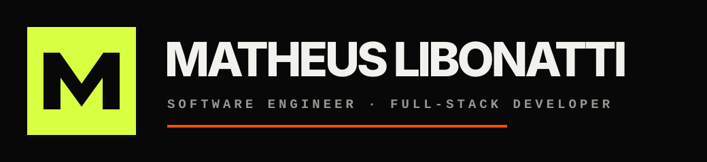

<div align="center">
  

  <h3>Software que trabalha de verdade.</h3>

  <p>
    Portfólio e publicação técnica multilíngue para apresentar projetos,<br />
    compartilhar conhecimento e transformar problemas complexos em produtos claros.
  </p>

  <p>
    <a href="http://46.202.151.198:8080/pt-br/"><strong>Ver o site</strong></a>
    ·
    <a href="http://46.202.151.198:8080/pt-br/blog/">Blog PT-BR</a>
    ·
    <a href="http://46.202.151.198:8080/es/blog/">Blog ES-LATAM</a>
    ·
    <a href="http://46.202.151.198:8080/en/blog/">Blog EN</a>
  </p>
</div>

---

## Sobre o projeto

O **Libonatti Software System** é a presença digital de Matheus Libonatti: engenheiro de software e desenvolvedor full stack atuando entre estratégia, tecnologia e produto.

O projeto reúne:

- apresentação profissional e serviços;
- portfólio de produtos e plataformas;
- conteúdo sobre engenharia de software, inteligência artificial e web;
- experiência localizada para Brasil, América Latina e público internacional;
- uma identidade visual forte, técnica e reconhecível.

## Experiência multilíngue

| Público | Site | Blog | SEO |
|---|---|---|---|
| Brasil | `/pt-br/` | `/pt-br/blog/` | `pt-BR` |
| América Latina | `/es/` | `/es/blog/` | `es-419` |
| Internacional | `/en/` | `/en/blog/` | `en` |

Cada versão possui uma URL própria. As páginas utilizam `hreflang` para ajudar mecanismos de busca a relacionar os conteúdos traduzidos e entregar o idioma mais adequado.

## O que já existe

- Landing page profissional responsiva.
- Conteúdo em português, espanhol LATAM e inglês.
- Blog de tecnologia nos três idiomas.
- Primeiro artigo editorial completo.
- Navegação acessível e menu adaptado para dispositivos móveis.
- Rotas localizadas servidas por Nginx.
- Deploy em contêiner Docker.
- Redirecionamentos compatíveis com rotas anteriores.

## Arquitetura

```text
libonatti-software-system/
├── docs/
│   └── brand/
│       ├── README.md          # Manual da identidade visual
│       ├── logo-mark.svg      # Símbolo compacto ML
│       ├── logo-primary.svg   # Assinatura principal
│       └── tokens.css         # Cores, fontes, espaços e movimento
├── site/
│   ├── index.html             # Página principal multilíngue
│   ├── blog.html              # Blog e artigo inicial
│   ├── app.js                 # Conteúdo e interações do site
│   ├── blog.js                # Conteúdo localizado do blog
│   ├── styles.css             # Sistema visual da interface
│   ├── nginx.conf             # Rotas e redirecionamentos
│   └── Dockerfile             # Imagem de produção
└── README.md
```

## Rodando localmente

Requisitos: Docker instalado e a porta `8080` disponível.

```bash
docker build -t matheus-libonatti-site ./site
docker run --rm -p 8080:80 matheus-libonatti-site
```

Depois, acesse:

```text
http://localhost:8080/pt-br/
```

## Identidade visual

A linguagem visual combina preto profundo, branco mineral e cores de alta energia. Tipografia grande, linhas técnicas, grades e movimento ajudam a comunicar engenharia com personalidade.

| Token | Cor | Uso |
|---|---|---|
| Black | `#080808` | Fundo principal |
| Soft Black | `#111111` | Superfícies elevadas |
| Mineral White | `#F2F1ED` | Texto e áreas claras |
| Signal Lime | `#D9FF43` | Marca e destaque |
| Action Orange | `#FF4D00` | Ações e contato |
| Digital Violet | `#9C7CFF` | Projetos e contraste |

O manual completo, arquivos de logo e tokens reutilizáveis estão em [`docs/brand`](./docs/brand/README.md).

## Princípios

1. **Clareza antes da complexidade** — cada decisão deve tornar o produto mais compreensível.
2. **Tecnologia com propósito** — ferramentas existem para resolver problemas reais.
3. **Performance é experiência** — velocidade, acessibilidade e confiabilidade fazem parte do design.
4. **Construído para evoluir** — arquitetura e conteúdo devem crescer sem perder consistência.

## Próximos passos

- conectar o domínio oficial e certificados HTTPS;
- adicionar URLs canônicas e sitemap com o domínio definitivo;
- publicar novos artigos técnicos;
- substituir os placeholders pelos cases e imagens finais;
- incluir métricas de performance e resultados dos projetos.

---

<div align="center">
  <sub>Projetado e construído por Matheus Libonatti · Brasil · LATAM · Remote</sub>
</div>
