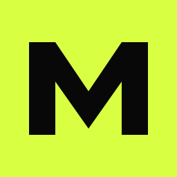

# Identidade visual

Este diretório é a fonte de verdade da marca **Matheus Libonatti**. Ele documenta como manter a mesma personalidade no site, blog, apresentações, redes sociais e novos produtos.

## Essência

**Posicionamento:** engenharia de software com clareza, personalidade e foco em resultado.

**Promessa:** transformar complexidade técnica em produtos digitais que funcionam de verdade.

**Tom de voz:** direto, confiante, humano e didático. Explicar sem simplificar demais e demonstrar domínio sem parecer distante.

## Logos

### Assinatura principal

Use a assinatura principal em capas, READMEs, apresentações e áreas com espaço horizontal.

### Símbolo compacto

Use o símbolo em avatares, favicons, cards, assinaturas pequenas e elementos de navegação.

### Área de proteção

Mantenha ao redor do logo um espaço mínimo equivalente a metade da largura do quadrado `ML`. Não encoste texto, bordas ou outros símbolos nessa área.

### Não fazer

- não alterar as proporções;
- não trocar o lime por uma cor fora da paleta;
- não adicionar sombras, degradês ou contornos ao símbolo;
- não rotacionar ou deformar;
- não usar sobre fundos com pouco contraste.

## Paleta

### Base

| Nome | Hex | RGB | Papel |
|---|---|---|---|
| Black | `#080808` | `8, 8, 8` | Fundo e contraste principal |
| Soft Black | `#111111` | `17, 17, 17` | Cards e superfícies |
| Mineral White | `#F2F1ED` | `242, 241, 237` | Texto claro e fundos editoriais |
| Interface Gray | `#979792` | `151, 151, 146` | Texto secundário |

### Sinais

| Nome | Hex | Papel |
|---|---|---|
| Signal Lime | `#D9FF43` | Marca, disponibilidade e destaques |
| Action Orange | `#FF4D00` | CTA, contato e energia |
| Digital Violet | `#9C7CFF` | Projetos, experimentação e IA |

Use apenas uma cor de sinal como protagonista por seção. O lime identifica a marca; o laranja convida à ação; o violeta diferencia narrativas experimentais.

## Tipografia

### Inter

Fonte principal da interface e do conteúdo. Pesos recomendados:

- `400` para textos;
- `500–600` para subtítulos;
- `700–900` para títulos de impacto.

### Geist Mono

Fonte técnica para metadados, números, categorias, tags, datas e pequenos rótulos. Use em caixa alta com espaçamento moderado.

### Escala sugerida

| Elemento | Tamanho | Entrelinha |
|---|---:|---:|
| Display | `clamp(62px, 9vw, 148px)` | `0.83` |
| H2 | `clamp(46px, 6vw, 96px)` | `0.93` |
| H3 | `27–46px` | `1.0–1.15` |
| Lead | `19–28px` | `1.35–1.5` |
| Body | `15–18px` | `1.45–1.65` |
| Label | `9–12px` | `1.0–1.4` |

## Layout

- Largura máxima principal: `1440px`.
- Largura editorial: `1180px`.
- Margem mínima: `20px`.
- Seções desktop: cerca de `130px` no eixo vertical.
- Bordas: `1px` com baixo contraste.
- Use grades assimétricas e bastante espaço negativo.
- Títulos podem ocupar grande parte da tela; textos longos devem permanecer entre `680px` e `760px`.

## Formas e elementos

- Quadrado: precisão, sistema e assinatura `ML`.
- Círculo: navegação, continuidade e movimento.
- Linhas finas: separação e estrutura técnica.
- Grade: arquitetura e construção.
- Texto outline: contraste entre conceito e execução.

## Movimento

Animações devem orientar, não distrair:

- entradas entre `200ms` e `600ms`;
- ticker linear e contínuo;
- rotação lenta somente em elementos decorativos;
- feedback imediato em links e botões;
- respeitar `prefers-reduced-motion` em novas implementações.

## Fotografia e imagens

Prefira:

- alto contraste;
- enquadramentos arquitetônicos;
- fundos limpos ou escuros;
- capturas de produto com contexto;
- diagramas simples e objetivos.

Evite bancos de imagem genéricos, mockups excessivamente decorativos e ilustrações que não expliquem o produto.

## Acessibilidade

- preserve contraste mínimo WCAG AA;
- não comunique significado apenas pela cor;
- mantenha foco de teclado visível;
- use texto alternativo descritivo;
- não transforme parágrafos inteiros em caixa alta;
- valide legibilidade em telas pequenas.

## Tokens

O arquivo [`tokens.css`](./tokens.css) contém as variáveis fundamentais prontas para reutilização em novas interfaces.

## Documentação detalhada

- [`colors.md`](./colors.md) — paleta, papéis semânticos e contraste;
- [`typography.md`](./typography.md) — famílias, pesos e hierarquia;
- [`logo-usage.md`](./logo-usage.md) — versões, área de proteção e usos incorretos;
- [`components.md`](./components.md) — aplicação da identidade nos componentes digitais.
